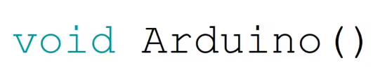

<p align="center"></p>
<h1 align="center"> Arduino Code </h1> 
<h4 align="right">Month 23</h4>


<br>

## Snippets code Arduino
Segmentos de códigos que utilizo para usos múltiples 

<br>

---
Copyright &copy; 2022 [carjavi](https://github.com/carjavi). <br>
```www.instintodigital.net``` <br>
carjavi@hotmail.com <br>
<p align="center">
    <a href="https://instintodigital.net/" target="_blank"></a>
</p>

# arduino-code
arduino-code
